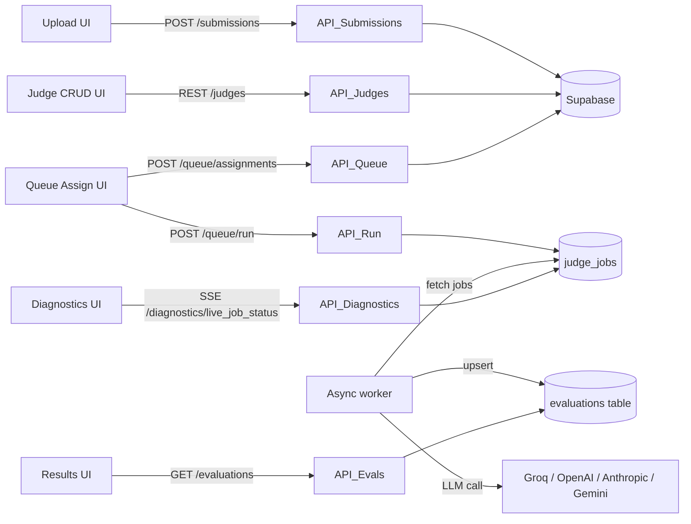
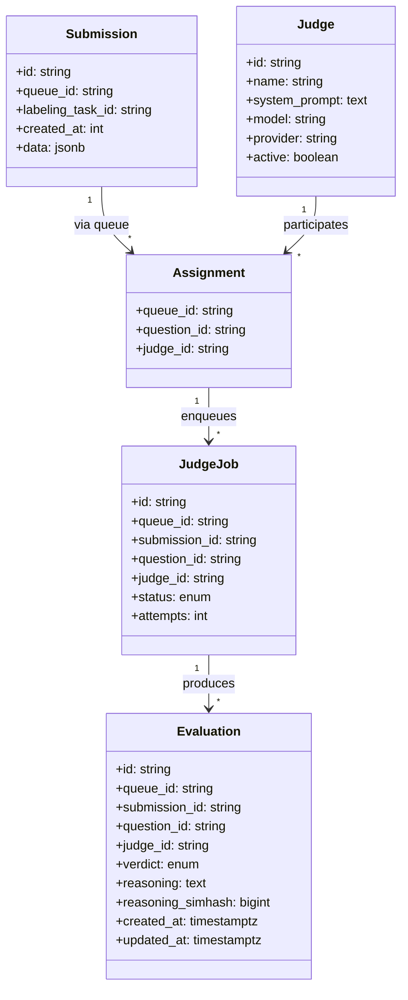

# Diagrams

## Request flow

```mermaid
flowchart LR
    Upload[Upload UI] -->|POST /submissions| API_Submissions
    API_Submissions --> Supabase[(Supabase)]
    Judges[Judge CRUD UI] -->|REST /judges| API_Judges
    API_Judges --> Supabase
    QueueUI[Queue Assign UI] -->|POST /queue/assignments| API_Queue
    API_Queue --> Supabase
    QueueUI -->|POST /queue/run| API_Run
    API_Run --> Jobs[(judge_jobs)]
    Worker[Async worker] -->|fetch jobs| Jobs
    Worker -->|LLM call| Providers[Groq / OpenAI / Anthropic / Gemini]
    Worker -->|upsert| Evaluations[(evaluations table)]
    ResultsUI[Results UI] -->|GET /evaluations| API_Evals
    API_Evals --> Evaluations
    DiagnosticsUI[Diagnostics UI] -->|SSE /diagnostics/live_job_status| API_Diagnostics
    API_Diagnostics --> Jobs
```

## Data model snapshot

```mermaid
classDiagram
    class Submission {
        +id: string
        +queue_id: string
        +labeling_task_id: string
        +created_at: int
        +data: jsonb
    }
    class Judge {
        +id: string
        +name: string
        +system_prompt: text
        +model: string
        +provider: string
        +active: boolean
    }
    class Assignment {
        +queue_id: string
        +question_id: string
        +judge_id: string
    }
    class JudgeJob {
        +id: string
        +queue_id: string
        +submission_id: string
        +question_id: string
        +judge_id: string
        +status: enum
        +attempts: int
    }
    class Evaluation {
        +id: string
        +queue_id: string
        +submission_id: string
        +question_id: string
        +judge_id: string
        +verdict: enum
        +reasoning: text
        +reasoning_simhash: bigint
        +created_at: timestamptz
        +updated_at: timestamptz
    }

    Submission "1" --> "*" Assignment : via queue
    Assignment "1" --> "*" JudgeJob : enqueues
    JudgeJob "1" --> "*" Evaluation : produces
    Judge "1" --> "*" Assignment : participates
```
