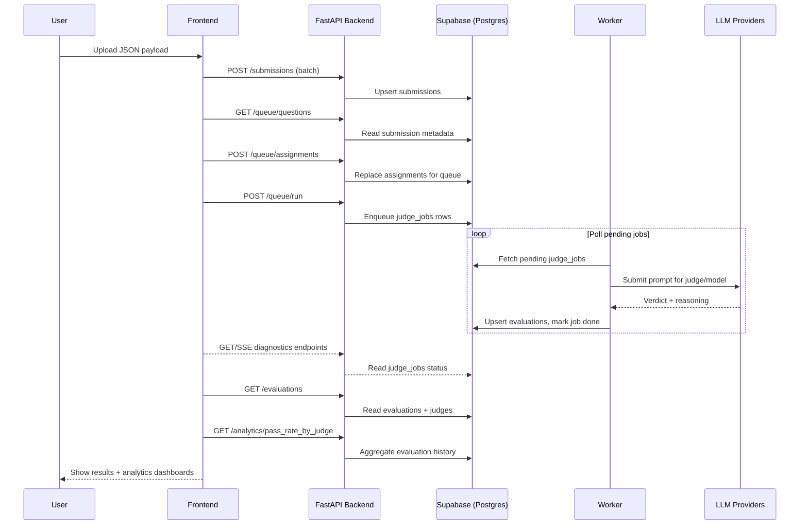
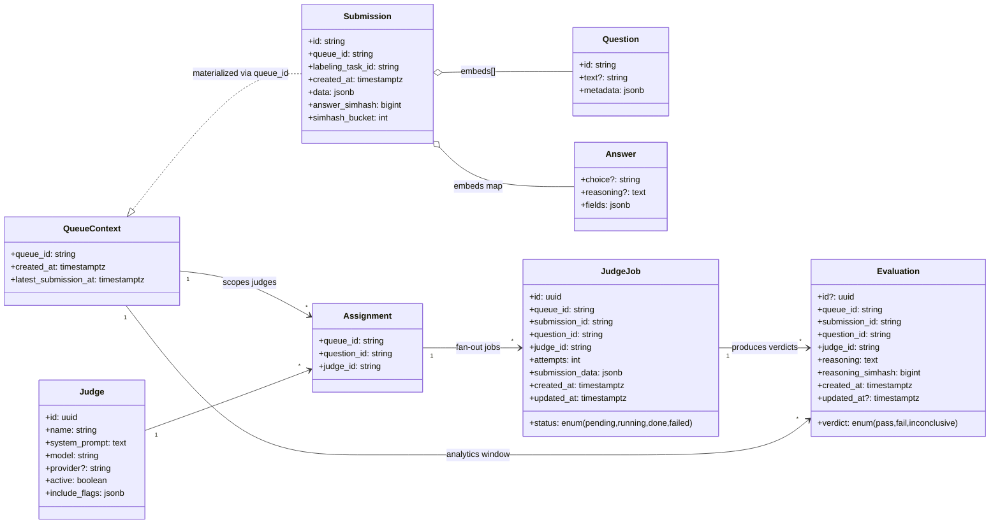
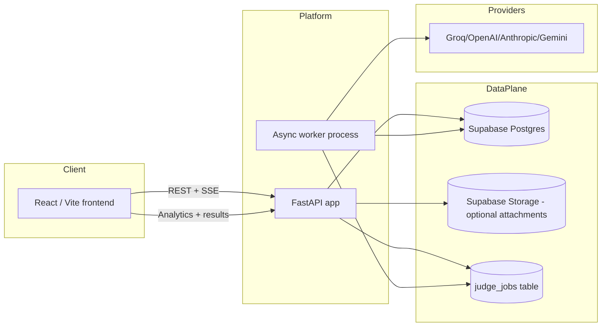

# Diagrams

## App flow sequence

```mermaid
sequenceDiagram
    participant User
    participant Frontend
    participant API as FastAPI Backend
    participant DB as Supabase (Postgres)
    participant Worker
    participant LLM as LLM Providers

    User->>Frontend: Upload JSON payload
    Frontend->>API: POST /submissions (batch)
    API->>DB: Upsert submissions
    Frontend->>API: GET /queue/questions
    API->>DB: Read submission metadata
    Frontend->>API: POST /queue/assignments
    API->>DB: Replace assignments for queue
    Frontend->>API: POST /queue/run
    API->>DB: Enqueue judge_jobs rows
    loop Poll pending jobs
        Worker->>DB: Fetch pending judge_jobs
        Worker->>LLM: Submit prompt for judge/model
        LLM-->>Worker: Verdict + reasoning
        Worker->>DB: Upsert evaluations, mark job done
    end
    Frontend-->>API: GET/SSE diagnostics endpoints
    API-->>DB: Read judge_jobs status
    Frontend->>API: GET /evaluations
    API->>DB: Read evaluations + judges
    Frontend->>API: GET /analytics/pass_rate_by_judge
    API->>DB: Aggregate evaluation history
    Frontend-->>User: Show results + analytics dashboards
```

## Data model snapshot

```mermaid
classDiagram
    direction LR
    class QueueContext {
        +queue_id: string
        +created_at: timestamptz
        +latest_submission_at: timestamptz
    }
    class Submission {
        +id: string
        +queue_id: string
        +labeling_task_id: string
        +created_at: timestamptz
        +data: jsonb
        +answer_simhash: bigint
        +simhash_bucket: int
    }
    class Question {
        +id: string
        +text?: string
        +metadata: jsonb
    }
    class Answer {
        +choice?: string
        +reasoning?: text
        +fields: jsonb
    }
    class Assignment {
        +queue_id: string
        +question_id: string
        +judge_id: string
    }
    class Judge {
        +id: uuid
        +name: string
        +system_prompt: text
        +model: string
        +provider?: string
        +active: boolean
        +include_flags: jsonb
    }
    class JudgeJob {
        +id: uuid
        +queue_id: string
        +submission_id: string
        +question_id: string
        +judge_id: string
        +status: enum(pending,running,done,failed)
        +attempts: int
        +submission_data: jsonb
        +created_at: timestamptz
        +updated_at: timestamptz
    }
    class Evaluation {
        +id?: uuid
        +queue_id: string
        +submission_id: string
        +question_id: string
        +judge_id: string
        +verdict: enum(pass,fail,inconclusive)
        +reasoning: text
        +reasoning_simhash: bigint
        +created_at: timestamptz
        +updated_at?: timestamptz
    }

    QueueContext <|.. Submission : materialized via queue_id
    Submission o-- Question : embeds[]
    Submission o-- Answer : embeds map
    QueueContext "1" --> "*" Assignment : scopes judges
    Assignment "1" --> "*" JudgeJob : fan-out jobs
    Judge "1" --> "*" Assignment
    JudgeJob "1" --> "*" Evaluation : produces verdicts
    QueueContext "1" --> "*" Evaluation : analytics window
```

## Infra overview

```mermaid
flowchart LR
    subgraph Client
        FE[React / Vite frontend]
    end
    subgraph Platform
        API[FastAPI app]
        Worker[Async worker process]
    end
    subgraph DataPlane
        DB[(Supabase Postgres)]
        Storage[(Supabase Storage - optional attachments)]
        Queue[(judge_jobs table)]
    end
    subgraph Providers
        LLMs[Groq/OpenAI/Anthropic/Gemini]
    end

    FE -->|REST + SSE| API
    API --> DB
    API --> Storage
    API --> Queue
    Worker --> Queue
    Worker --> LLMs
    Worker --> DB
    FE -->|Analytics + results| API
```
