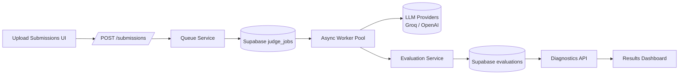
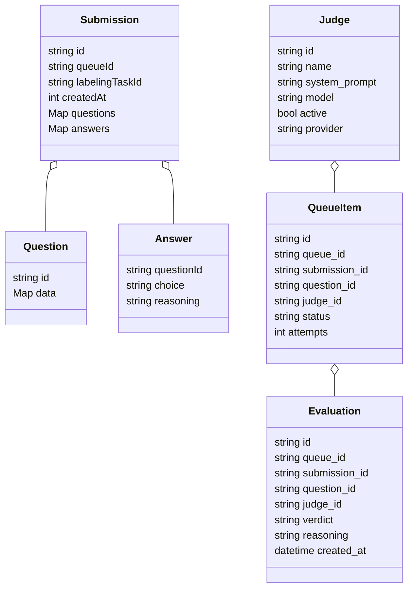

# Besimple AI Judge Platform

This repository hosts a full-stack evaluation workspace designed for the Besimple AI judge challenge. It exposes a FastAPI backend, a Supabase persistence layer, and a Tailwind/Vite React frontend that walks reviewers through uploading submissions, configuring judges, managing queues, and reviewing evaluation results.

## Repository layout

```
.
├── frontend/             # React + Vite dashboard, hooks, and UI primitives
└── server/               # FastAPI application, worker, and service layer
```

## Prerequisites

- Node.js 18+ (tested with Vite 7 / React 19)
- Python 3.11+
- Supabase project (or compatible Postgres) with tables: `submissions`, `judges`, `judge_jobs`, `evaluations`, `queue_assignments`
- Optional: Groq & OpenAI API accounts for LLM-backed judging

## Local setup

### Backend (FastAPI + worker)

```bash
cd server
python -m venv venv
source venv/bin/activate
pip install -r requirements.txt
uvicorn main:app --reload --host 0.0.0.0 --port 8000
```

Run the async worker in a separate shell once the API is up:

```bash
cd server
source venv/bin/activate
python worker.py
```

### Frontend (React + Vite)

```bash
cd frontend
npm install
npm run dev
```

The frontend proxies API traffic to `VITE_API_URL` (defaults to `http://localhost:8000`).

## Environment variables

### Backend

| Key | Description |
| --- | --- |
| `SUPABASE_URL` | Supabase project URL |
| `SUPABASE_KEY` | Supabase service role key used for privileged inserts/updates |
| `GROQ_API_KEY` | Required for Groq LLM integration |
| `OPENAI_API_KEY` | Optional OpenAI key (if absent, Groq-only execution proceeds) |
| `CORS_ALLOW_ORIGINS` | Comma-separated origins allowed by the API (defaults to `http://localhost:5173`) |
| `UPLOAD_BATCH_SIZE` | Max submissions per upsert batch (default 100) |
| `RUN_JUDGES_PER_PAGE` | Pagination size for queue runs |
| `JOB_BATCH_SIZE` | Number of jobs dequeued per polling cycle |
| `WORKER_CONCURRENCY` | Max concurrent judge executions (default 4) |
| `WORKER_BATCH` | Supabase batch size pulled each poll (default 10) |
| `WORKER_POLL_INTERVAL` | Seconds between queue polls (default 5.0) |
| `WORKER_JUDGE_REFRESH` | Seconds between judge metadata refreshes (default 60) |

### Frontend

| Key | Description |
| --- | --- |
| `VITE_API_URL` | Base URL for API client requests |

## Architecture overview



Key traits:

- All ingestion routes validate payload structure and stream submissions in configurable batches.
- Queue orchestration writes jobs into Supabase and hands off to an async worker with configurable concurrency, protected by exponential backoff on 429/timeout errors.
- Evaluations are persisted with queue identifiers so the UI can filter by workflow step, and the worker now performs a check-then-insert safeguard to avoid rewriting identical verdicts while still updating when reasoning changes.

## Evaluation run flow

1. **Upload** — Operators import submissions via the upload wizard, which issues batched POST requests to the backend.
2. **Assign judges** — The queue page loads available judges and questions, persisting assignments once per queue.
3. **Run evaluations** — Triggering the run endpoint enqueues jobs and shows live diagnostics; once all jobs finish, the UI displays a five-second countdown before redirecting to the results page.
4. **Worker processing** — Background workers drain `judge_jobs`, call the appropriate LLM provider, and persist evaluations idempotently.
5. **Review** — The results dashboard surfaces verdicts, filters, and pass-rate metrics scoped to the active queue.

## Data model



## Scalability & reliability plan

### Database & storage
- Partition the `judge_jobs` table by `queue_id` and time-based buckets; add composite indexes on `(queue_id, status)` to accelerate polling.
- Retain raw submission payloads in object storage (e.g., S3) and store references in Supabase for large attachments.
- For analytics-at-scale, replicate evaluations into ClickHouse or TimescaleDB to support aggregation without overloading OLTP tables.

### Worker architecture
- Feed queue events through a message broker (RabbitMQ / Kafka / SQS) when job volume surpasses single-region Supabase throughput.
- Auto-scale worker deployments based on pending job count and measured LLM latency; keep tasks idempotent via job IDs and retry counters.
- Maintain per-provider concurrency caps and exponential backoff on 429 / timeout responses (already wired via `backoff.expo`).

### LLM cost + rate-limit controls
- Cache identical prompts/results for deterministic judges and reuse verdicts when the submission hash matches.
- Batch prompts whenever the provider supports it (e.g., evaluation-of-many) to amortize context windows.
- Implement prompt sampling knobs so operators can downsample evaluations under heavy load while keeping critical judges active.
- Surface rolling cost estimates (tokens × model price) in diagnostics to tune queue sizing proactively.

### Monitoring & observability
- Emit structured logs for queue transitions (`pending -> running -> done/failed`) and ship to a central log store (e.g., OpenTelemetry + Grafana Loki).
- Record metrics per queue: job throughput, average verdict latency, LLM error rates; wire dashboards/alerts for anomalies.
- Trace each evaluation end-to-end (request ID across API, worker, and insert) for root-cause analysis when verdicts look inconsistent.

### Latency, accuracy, and cost trade-offs
- **Latency vs cost:** running more judges in parallel lowers queue time but increases LLM spend; expose queue-level concurrency knobs per judge persona.
- **Accuracy vs cost:** allow ensembles of judges with majority voting; support optional “audit” reruns on disagreements rather than re-evaluating every submission.
- **Latency vs accuracy:** quick “pass/fail” models can pre-screen submissions before dispatching to expensive detailed judges.

## Migration & cleanup summary

- Converted the React workflow to lean on page-level hooks and archived the old entry points under `src/legacy`, logging dev warnings when imported.
- Guarded queue and results effects against stale updates while continuing to run all network calls through the shared `safeAsync` helper.
- Updated the worker service to fetch-before-insert, keeping evaluation writes idempotent without hammering Supabase.
- Added a post-run countdown in the queue view so operators can read the final status before the app navigates to results.